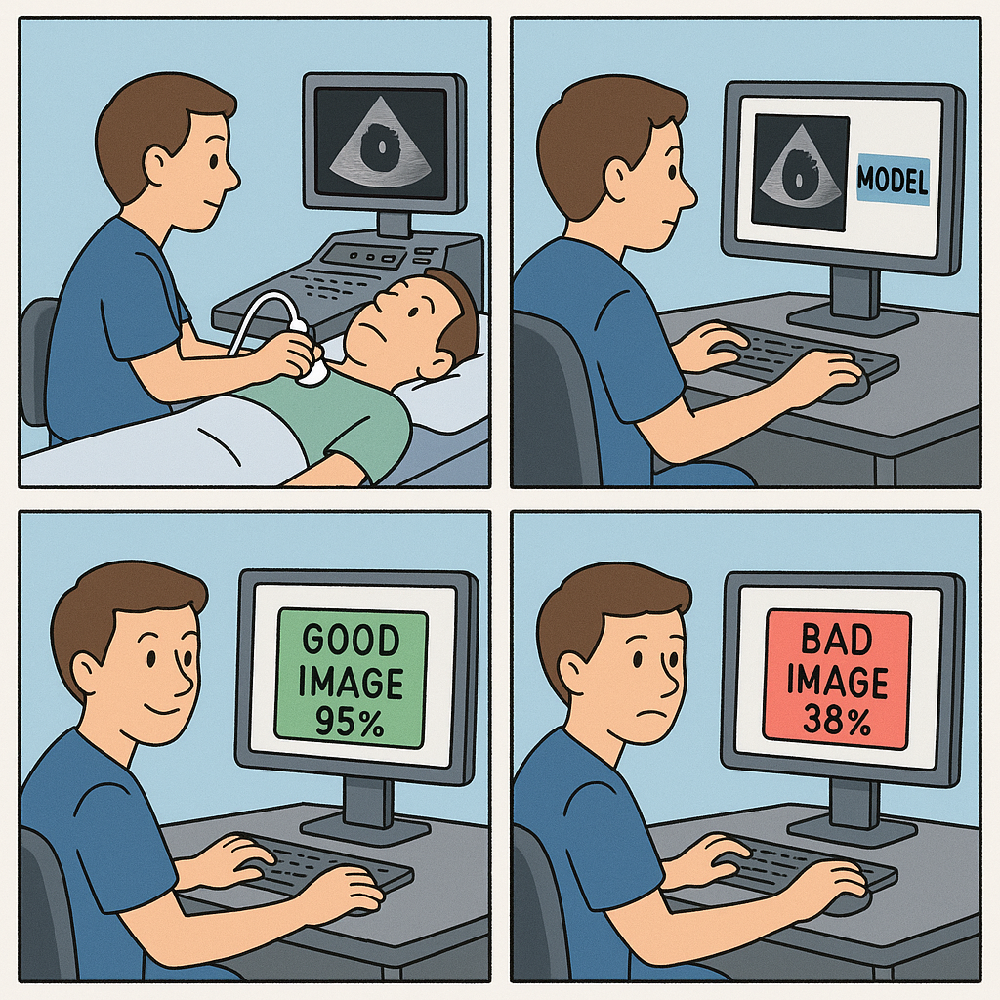
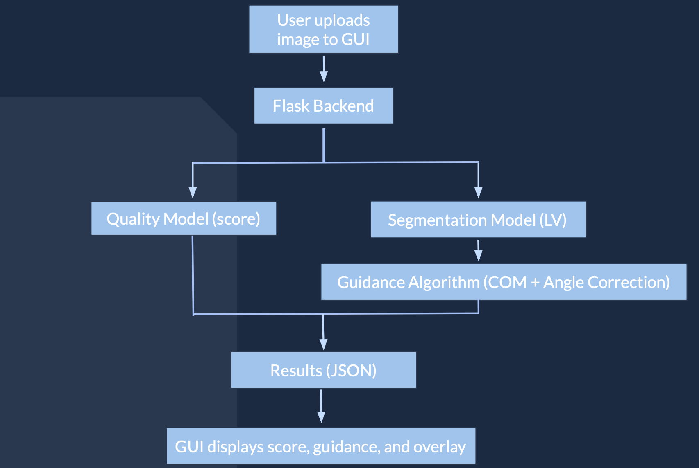
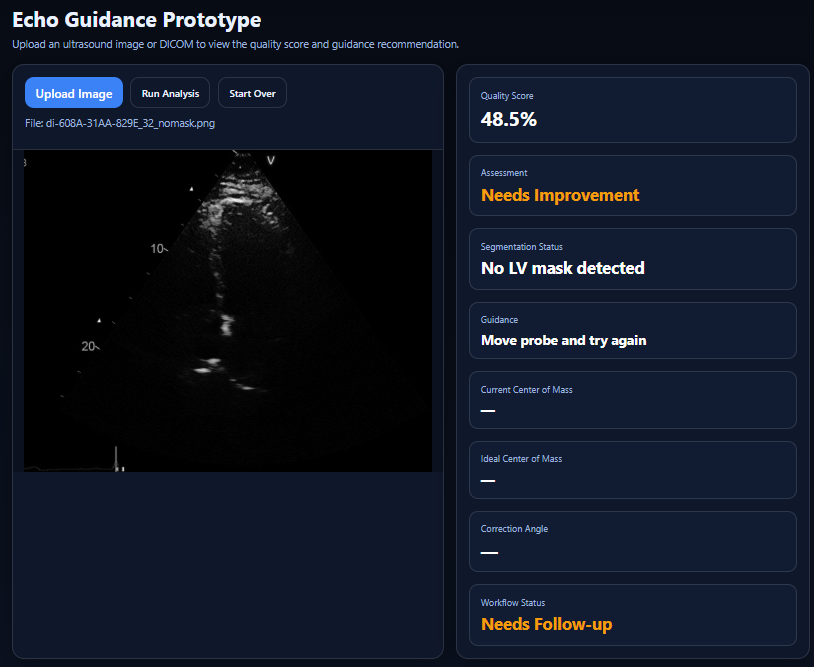
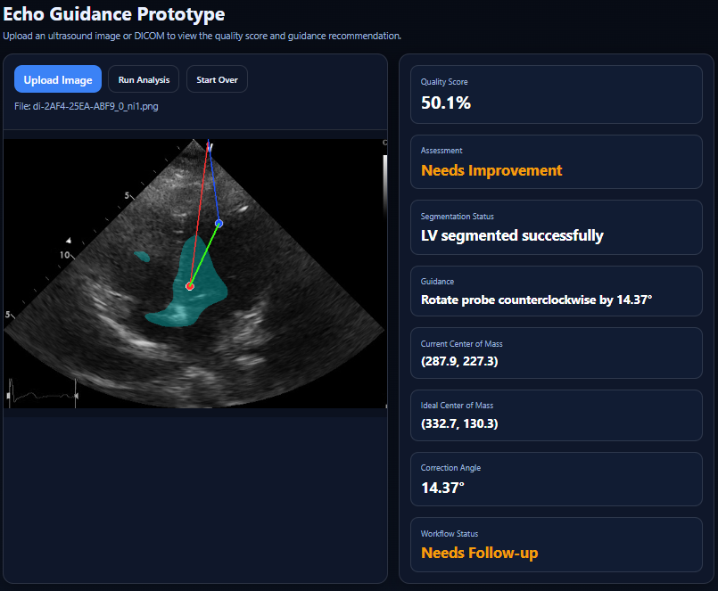
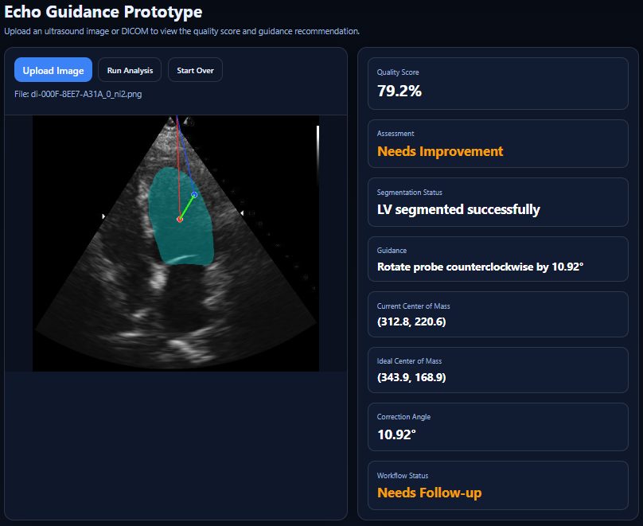
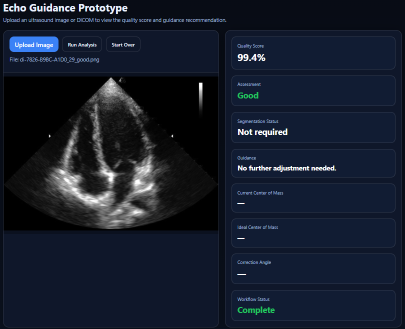
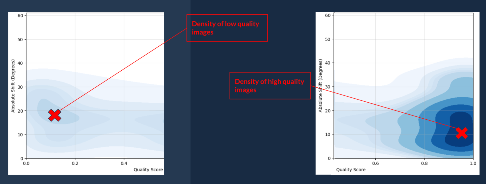

# Echocardiogram Acquisition Guidance System

**BME 445B Final Report – Spring 2026**

*Aava Abedinpour, Jaron Kawamura, Lindsay Best*  
*Group 7 | Alfred E. Mann Department of Biomedical Engineering*  
*USC Viterbi School of Engineering*

---

## Table of Contents

1. [Executive Summary](#executive-summary)
   - 1.1 [Clinical Workflow](#11-clinical-workflow)
   - 1.2 [Tools & Technologies](#12-tools--technologies)
2. [Problem Definition & Stakeholder Analysis](#problem-definition--stakeholder-analysis)
   - 2.1 [Clinical Problem & Unmet Need](#21-clinical-problem--unmet-need)
   - 2.2 [Stakeholder Identification](#22-stakeholder-identification)
   - 2.3 [FDA Regulatory Pathway & Predicate Device](#23-fda-regulatory-pathway--predicate-device)
3. [Use Case Scenario to Features & Technical Specifications](#use-case-scenario-to-features--technical-specifications)
   - 3.1 [Target User & Scenario](#31-target-user--scenario)
   - 3.2 [Functional Requirements & Specifications](#32-functional-requirements--specifications)
4. [Engineering Design Report & Process Flow Diagrams](#engineering-design-report--process-flow-diagrams)
   - 4.1 [Functional Requirements Table](#41-functional-requirements-table)
   - 4.2 [System Architecture](#42-system-architecture)
   - 4.3 [Data Flow](#43-data-flow)
   - 4.4 [Design Rationale](#44-design-rationale)
5. [Live Prototype Demonstration](#live-prototype-demonstration)
6. [Demonstration Video](#demonstration-video)
7. [Fabrication, Assembly & System Integration Analysis](#fabrication-assembly--system-integration-analysis)
   - 7.1 [Software Environment](#71-software-environment)
   - 7.2 [Quality Score Model](#72-quality-score-model)
   - 7.3 [Segmentation Model](#73-segmentation-model)
   - 7.4 [Guidance Recommendation Algorithm](#74-guidance-recommendation-algorithm)
   - 7.5 [Strengths & Weaknesses](#75-strengths--weaknesses)
   - 7.6 [Future Improvements](#76-future-improvements)
8. [Testing & Validation](#testing--validation)
9. [Technical Difficulty Assessment](#technical-difficulty-assessment)
10. [Lessons Learned, Institutional Knowledge & Regulatory Insight](#lessons-learned-institutional-knowledge--regulatory-insight)
11. [Appendix: Lab Notebook & Documentation](#appendix-lab-notebook--documentation)
12. [References](#references)

---

## Executive Summary

This report describes the design, implementation, and results of an echocardiogram acquisition guidance system developed for BME 445B, Spring 2026. The system is designed as a training tool for sonographers, providing automated image quality scoring and probe adjustment guidance for apical four-chamber (A4C) echocardiogram views.

Echocardiogram acquisition requires highly trained professionals, yet over 100,000 echocardiograms are performed daily in settings where trained technicians are scarce — particularly in rural areas. Our system addresses this gap by giving sonography students rapid, quantitative feedback on image quality and actionable guidance on how to improve their probe positioning.

The system integrates three components: 
1. A ResNet-8 quality score model trained on 10,000 labeled A4C images achieving a validation RMSE of 0.23 and AUC-ROC of 0.88
2. A pretrained left-ventricle segmentation model adapted to our data structure
3. A center-of-mass guidance algorithm that recommends a rotation angle to move toward optimal probe positioning

These are wrapped in a browser-based GUI supporting DICOM, PNG, and JPEG uploads.

### 1.1 Clinical Workflow

The echocardiogram workflow our system targets proceeds as follows:

- **Acquisition**: A sonographer attempts to acquire an A4C view using an ultrasound probe on a patient or training phantom.
- **Upload**: The sonographer downloads the captured frame from the ultrasound workstation and uploads it to the guidance system GUI.
- **Scoring**: The quality score model returns a score between 0 and 1. Scans below a threshold prompt the user to keep searching for a usable view.
- **Guidance**: For segmentable images, the LV is segmented, center of mass computed, and a rotation angle recommendation is returned.
- **Iteration**: The sonographer adjusts probe orientation and repeats until satisfied with the quality score.

### 1.2 Tools & Technologies

- **PyTorch**: Deep learning framework used for both quality score model training (ResNet-8) and segmentation model inference.
- **Google Colab Pro**: GPU-accelerated cloud compute environment for model training. Google Drive provided storage for the 70 GB dataset and all model outputs.
- **scikit-image / OpenCV**: Image processing libraries used for preprocessing, segmentation mask postprocessing, and center-of-mass calculations.
- **Flask**: Python web framework for the browser-based GUI, locally hosted on a laptop.
- **VS Code / ChatGPT**: Primary development environment for GUI construction. ChatGPT assisted with GUI code generation.
- **Claude (Anthropic)**: Used for debugging and adapting the segmentation model to our Google Drive data structure.
- **Git / GitHub**: Version control and code hosting.
- **iCardio Dataset**: ~40,000 A4C echocardiogram studies (~70 GB) provided under NDA. Used for quality score model training and guidance algorithm development.

---

## Problem Definition & Stakeholder Analysis

### 2.1 Clinical Problem & Unmet Need

In clinical practice, echocardiograms require highly trained professionals to capture diagnostic-quality ultrasound images. Over 100,000 echocardiograms are performed daily, yet a significant shortage of trained sonographers exists — particularly in rural areas. This gap leads to a lower standard of care for patients who rely on these life-saving scans for diagnosis and management of structural heart disease.

Becoming a cardiac sonographer requires a substantial investment of time and money: education alone can cost upwards of $17,000 and take over a year (UCSF). Delays in access to trained sonographers can be catastrophic, as many cardiac conditions depend on early detection to prevent disease progression. An estimated millions of patients annually are affected by diagnostic delays or access gaps attributable to sonographer shortages.

To address this, there is an unmet need for a tool that trains sonographers more efficiently by providing real-time, quantitative feedback on image quality and actionable guidance on probe correction — reducing the time and cost of training while improving sonographer competency.

### 2.2 Stakeholder Identification

The key stakeholders in our use case are:

- **Sonographers (Primary)**: The direct users of the system during training. If sonographers do not engage with the system, it has no utility. Their needs drive all design decisions: the system must be easy to use, provide clear feedback, and integrate naturally into existing ultrasound workstation workflows.
- **Hospitals & Training Programs**: Benefit from faster, more standardized sonographer training. Better-trained sonographers produce higher-quality scans, allowing hospitals to serve more patients and reducing repeat-scan rates.
- **Cardiologists**: Benefit from consistently higher-quality images, which streamline diagnosis and reduce the time required for image interpretation.
- **Patients**: Receive more timely, accurate diagnoses as a result of improved sonographer skill and image consistency.
- **Future Students & Instructors (BME 445B)**: Lessons learned and key pivots from this project are shared to help future teams avoid the same pitfalls.

The most important features relative to stakeholder needs are ease of use, accuracy of quality scoring, and actionable feedback that clearly explains image quality issues and provides guidance on how to improve scan acquisition.

### 2.3 FDA Regulatory Pathway & Predicate Device

The proposed indication for use is as a training aid for sonographers learning to acquire echocardiograms. For this project, the system is intentionally scoped as a training tool rather than a clinical decision-support device. As a training aid that does not directly influence patient diagnosis or treatment, FDA submission is not required under current guidance.

A predicate device is K200755 — the Caption Guidance system from Caption Health (now GE Healthcare), a 510(k)-cleared real-time echocardiogram acquisition feedback system. Key differences between our system and the predicate:

- **Training approach**: Caption Health trained on probe position and orientation data; our system uses an image-based segmentation approach to derive guidance from the acquired frame itself.
- **Intended use**: Caption Health is designed for clinical use to assist trained professionals. Our system is intended as a training tool for students learning probe technique.

If the system were to be developed into a clinical decision-support tool, a 510(k) pathway using K200755 as the predicate would be the appropriate regulatory route. The intended use would then expand to: a software system intended to provide real-time feedback to sonographers acquiring echocardiogram images to improve image quality for diagnostic purposes.

---

## Use Case Scenario to Features & Technical Specifications

### 3.1 Target User & Scenario

The echocardiogram feedback system is primarily designed for use in a classroom or clinical training environment. The target demographic is sonography students who are predominantly under the age of 35, have limited clinical education, and face a high cognitive load when navigating complex cardiac anatomy. The software is installed on or accessible from the ultrasound workstation.

The use case proceeds as follows: A sonographer student attempts to acquire an A4C view of the heart on a training phantom or patient. Believing they have captured a reasonable image, they download the frame from the ultrasound system and upload it to the guidance system GUI. The system returns a quality score and, if the score is sufficient for segmentation, a recommended probe rotation angle. The student accepts the correction if provided and repeats the acquisition process. Over multiple iterations, the student develops an intuition for optimal probe placement and learns what constitutes a high-quality A4C view.

The current MVP is scoped to the A4C view.

  
*Figure 1. Mock-up of product use case (AI-generated illustration, ChatGPT DALL-E).*

### 3.2 Functional Requirements & Specifications

Functional requirements were extracted from the use case by translating qualitative user needs into measurable technical specifications:

- **Accuracy**: The quality score model must reliably distinguish 'good' from 'needs improvement' images. Specification: AUC-ROC ≥ 0.80 on held-out validation set.
- **Ease of use**: The GUI must require no command-line interaction. Specification: All interactions accomplished through button clicks and file upload dialogs; no user training required beyond simple verbal instructions.
- **Actionable feedback**: The system must return a quantified recommendation. Specification: Guidance output is a rotation angle in degrees (e.g., 'rotate probe 12° clockwise') derived from the center-of-mass offset between current and target LV position.
- **File format support**: Specification: GUI accepts .png, .jpg, .jpeg, and .dcm files.
- **Extensibility**: System architecture must support frame-level analysis, landmark detection, and eventual live system integration. Specification: Modular pipeline where quality score model, segmentation model, and guidance algorithm are independently replaceable.

---

## Engineering Design Report & Process Flow Diagrams

### 4.1 Functional Requirements Table

| Requirement | How Requirement is Fulfilled |
|---|---|
| Recommendations improve image quality | User receives a specific rotation angle recommendation to move the probe toward the target LV center of mass, providing a quantified correction rather than generic feedback. |
| User can upload many image types to GUI | The GUI accepts .png, .dcm, .jpeg, and .jpg files through a simple upload dialog — no command-line interaction required. |
| GUI is user friendly | All interactions are button-driven. No programming knowledge is required to operate the system. |
| Quality score model distinguishes good from poor images | ResNet-8 model trained on 10,000 labeled A4C images; validation RMSE of 0.23, AUC-ROC of 0.88. |
| Guidance algorithm is validated | Angle recommendations are inversely correlated with quality score across 1,000 test cases (Pearson p = 0.003), confirming that higher-quality images receive smaller corrections. |

### 4.2 System Architecture

The system consists of three major software components integrated through a Flask-based web GUI:

- **Quality Score Model (ResNet-8)**: Accepts an echocardiogram image and returns a continuous quality score (0–1). Images below a threshold trigger a 'keep searching' prompt; images above threshold proceed to segmentation.
- **LV Segmentation Model**: Pretrained segmentation model (Gong, 2023) adapted to our data structure. Segments the left ventricle from the uploaded image, producing a binary mask used for center-of-mass calculation.
- **Guidance Algorithm**: Computes the current LV center of mass from the segmentation mask, identifies the image apex, and calculates the angular offset to the target COM derived from top-quality reference images. Returns a rotation angle recommendation in degrees.

  
*Figure 2. System block diagram / data flow diagram showing inputs, processing stages, and outputs.*

### 4.3 Data Flow

Data flows through the system as follows:
1. User uploads an echocardiogram image (PNG, JPEG, or DICOM)
2. Image is preprocessed and passed to the quality score model
3. If quality score exceeds threshold, image is passed to the LV segmentation model
4. Segmentation mask is used to compute the current LV center of mass
5. Angular offset from current COM to target COM is calculated
6. Quality score and rotation angle recommendation are displayed in the GUI

### 4.4 Design Rationale

The segmentation-based guidance approach was selected over a probe-position-and-orientation approach (as used by Caption Health) because our data source — iCardio — did not include probe orientation metadata, only images and quality scores. This constraint drove the design toward an image-only pipeline that extracts spatial information from the segmented LV rather than from external sensors.

A concept screening matrix was used to evaluate three candidate guidance strategies:
1. Direct quality score regression with no spatial guidance
2. LV center-of-mass offset (selected)
3. A Procrustes alignment approach using all four cardiac chambers

The COM approach was selected for its balance of implementability within the project timeline, interpretability of output (a single angle), and validability against quality score ground truth.

---

## Live Prototype Demonstration

Live demonstration was presented on April 21, 2026.

The demonstration highlighted the end-to-end workflow: a test echocardiogram image was uploaded through the GUI, processed by the quality score model, passed through the segmentation pipeline, and returned with a quality score and rotation angle recommendation. Both positive cases (high-quality images receiving low-angle corrections) and negative cases (low-quality images triggering the 'keep searching' prompt) were demonstrated.

The GUI's simplicity was a focal point: the entire workflow was completed without command-line interaction, underscoring the system's suitability for use by non-technical sonography students.

*Figure 3. Screenshots of GUI test cases as shown in the Live Demonstration.*

---

## Demonstration Video

The demonstration video was submitted to the Video Demonstration folder on Brightspace. The video covers:

- Purpose of the system and target user demographic (sonography students training in A4C view acquisition).
- Demonstration of the system being operated per the use case scenario, including upload, quality scoring, segmentation, and guidance output.
- Technical explanation of two key realizations:
  1. The ResNet-8 quality score model training methodology and validation approach
  2. The LV center-of-mass guidance algorithm and its validation against quality score ground truth.

---

## Fabrication, Assembly & System Integration Analysis

### 7.1 Software Environment

Google Colab Pro was used for expanded Google Drive storage, increased RAM and GPU tokens, and upgraded Gemini access. All scans, segmentation outputs, and project data were stored in Google Drive. Working within the Google ecosystem was convenient given that Colab, Drive, and Gemini are natively integrated.

VS Code and ChatGPT were used to build the GUI, with test scans pulled from Google Drive for analysis. The GUI is hosted locally on a laptop. Gemini's Chrome extension was convenient for native code feedback within Google Colab, though Claude generated more consistently correct code for our pipeline. In January, USC deployed ChatGPT Edu (Plus) for all students; ChatGPT was used for minimal code generation outside of GUI construction. A step-by-step guide for running the system is provided in the GitHub repository.

### 7.2 Quality Score Model

10,000 A4C images from distinct studies, each labeled with a quality score by iCardio clinicians, were used to train the quality score model. A ResNet-8 architecture was used for this regression task. Training was conducted in Google Colab Pro with GPU acceleration.

**Validation results on an independent held-out set:**

- **Validation RMSE**: 0.23
- **AUC-ROC (binary threshold 0.5)**: 0.88
- **AUC-PR**: 0.85

These results indicate the model reliably distinguishes between good-quality and poor-quality images, fulfilling the primary functional requirement for the quality scoring component.

### 7.3 Segmentation Model

Pretrained segmentation model weights from Gong (2023) were adapted to our workflow and data structure in Google Drive using Claude for code generation. This pipeline segments the left ventricle from uploaded echocardiogram frames, producing binary segmentation masks used as input to the guidance algorithm. Modifications to the original source code were necessary to align the model's expected input format with our image pipeline.

### 7.4 Guidance Recommendation Algorithm

The guidance algorithm proceeds as follows:

- **Quality triage**: Quality score model scores the uploaded image. If the score falls below threshold, the user is prompted to continue searching for an actionable view.
- **LV segmentation**: The LV is segmented using the adapted Gong model.
- **Current COM**: The center of mass of the LV segmentation mask is calculated (current COM).
- **Apex identification**: The apex of the image (top of the ultrasound field of view) is obtained by averaging the center of the top 50 pixel rows.
- **Target COM**: Average LV centers of mass from the top 1,000 images by quality score are used to define the target COM — a data-driven representation of optimal probe positioning.
- **Angle calculation**: From the current COM, apex, and target COM, the angular offset between the current and target positions is calculated and returned as the guidance recommendation.

Results were validated across 1,000 randomly selected test cases. Absolute guidance angle magnitudes were plotted against quality score.

  
*Figure 4. Guidance angle magnitude vs. quality score across 1,000 validation cases. Higher-quality images receive smaller angular corrections, validating the guidance algorithm's directional consistency.*

### 7.5 Strengths & Weaknesses

**Strengths of the current solution:**

- Image-only pipeline: requires no specialized hardware beyond the ultrasound system already present in training environments.
- Validated quality score model: ResNet-8 achieves AUC-ROC of 0.88 on clinician-labeled data, providing a reliable quality gate.
- Interpretable output: a rotation angle in degrees is more actionable than a generic quality label.
- Flexible GUI: supports multiple file formats without command-line interaction.

**Weaknesses of the current solution:**

- Scoped to A4C view only: the model and guidance algorithm must be retrained or adapted to support other standard echocardiogram views.
- Static target COM: the target center of mass is precomputed from training data and does not adapt to individual patient anatomy.
- No real-time processing: the current system processes single uploaded frames, not live video streams.
- Validation gap: the guidance algorithm's correlation with quality score is statistically supported (Pearson p = 0.003), but the Spearman result (p = 0.19) is non-significant due to the bimodal quality score distribution in our dataset, suggesting more validation data in the mid-quality range is needed.

### 7.6 Future Improvements

If development were to continue, the following improvements are prioritized:

- **Multi-view support**: Extend quality score model and segmentation pipeline to PLAX, PSAX, and other standard echocardiogram views.
- **Live video integration**: Process real-time ultrasound video streams for frame-by-frame guidance, more closely mirroring the Caption Health approach.
- **Landmark detection**: Replace center-of-mass guidance with multi-landmark detection (all four cardiac chambers) using a Procrustes-based alignment to provide more anatomically precise probe correction.
- **Expanded validation**: Collect additional labeled data in the mid-quality range to establish a monotonic relationship between guidance angle and quality score for Spearman validation.

---

## Testing & Validation

### Quality Score Model Validation

The quality score model was validated on an independent held-out set not used during training. Key metrics:

- **Validation RMSE**: 0.23 (on a 0–1 scale)
- **AUC-ROC**: 0.88 (binary threshold at score = 0.5)
- **AUC-PR**: 0.85

Area under the curve for Receiver Operating Characteristic (AUC-ROC) compares true positive and false positive rates. It is threshold agnostic, but can overemphasize the quality of an imbalanced dataset. On the other hand, area under the curve for precision-recall (AUC-PR) compares false positive (via precision) and false negative rates (via recall), which forces a focus on if the model predicts "good" images well, providing robustness even if the dataset is imbalanced. These results confirm the model can reliably distinguish good from poor quality images at a clinically relevant threshold.

### Guidance Algorithm Validation

The guidance algorithm was validated across 1,000 randomly selected test cases. The absolute value of the guidance angle recommendation was plotted against quality score to test whether higher-quality images receive smaller (i.e., closer to zero) corrections.

Using quality scores from the quality score model as ground truth:

- **Pearson correlation p-value**: 0.003 — statistically significant inverse relationship between angle magnitude and quality score.
- **Spearman correlation p-value**: 0.19 — non-significant monotonic trend, likely due to the bimodal distribution of quality scores in our dataset (many samples near 0 and near 1, few in the mid-range).

Quality score distribution of validation samples shown in Figure 5. The bimodal nature of the data limits the Spearman result; collecting additional labeled data in the 0.3–0.7 quality score range is a priority for future validation.

**Practical testing constraints**: All testing was conducted on retrospective data under NDA with iCardio. No human subject testing or clinical deployment occurred. If the system were to advance toward clinical use, IRB approval and HIPAA-compliant data handling protocols would be required for any prospective human subject study.

---

## Technical Difficulty Assessment

Machine learning tasks such as classification, regression, and the quality score model presented here are generally tractable with sufficient labeled data and compute. However, this project combined three distinct models — quality scoring, segmentation, and guidance — in a single integrated pipeline, which introduced non-trivial integration challenges.

The most technically difficult component was adapting the pretrained Gong segmentation model to our data structure and Google Drive environment. The original codebase was not designed for our workflow, and fitting the pretrained weights to our pipeline required significant debugging and code modification.

Conceptually, the most difficult challenge was designing a guidance algorithm that could be validated against available ground truth (quality scores). Without probe orientation data from iCardio, we had to derive spatial guidance from image content alone — a meaningful constraint that shaped the entire architecture.

**Technical highlights for review:**

- **Multi-model integration**: Three independently trained/adapted models combined in a single pipeline with a unifying GUI.
- **Guidance algorithm design**: A novel approach to deriving probe correction from image segmentation results, validated against clinician-labeled quality scores.
- **Large-scale dataset**: ~40,000 studies (~70 GB) processed and curated for model training.

---

## Lessons Learned, Institutional Knowledge & Regulatory Insight

### Resources & Collaborators

Being among the first teams to attempt a multi-model ML/AI project in BME 445B, we encountered many challenges that stemmed from the resources available to us. The following resources were most useful:

- **iCardio (Anna Gilgur COO; Roman Sandler CTO; Joseph Sokol co-CEO)**: Provided the 70 GB echocardiogram dataset under NDA and served as our primary clinical collaborator and SME. Three meetings over the course of the year were insufficient for the complexity of the project; future teams should clearly communicate expectations for SME involvement at the outset.

- **Dr. Brent Liu**: Provided early-stage guidance on project feasibility. His observation that probe orientation data would be critical proved prescient.

- **Dr. Jesse Yen**: Connected us with Rafael, an echocardiographer at USC Verdugo Hospital. Despite multiple follow-ups, a shadowing session could not be arranged before end of semester. Reach out to clinical SMEs early and follow up frequently.

- **Dr. Trent Benedick**: Flagged data storage setup as the most critical early risk — correct. File structure for model training is foundational; chatbots are helpful for writing file organization code once you know what you want.

- **GitHub (Gong, 2023)**: Source code for the LV segmentation model. Adapting rather than training from scratch was the right call given our timeline.

- **Google Colab Pro / Google One**: Essential for storage and GPU access given the scale of our dataset. Ensure you have sufficient storage before extracting large datasets (extraction of our 70 GB archive took ~1 week of runtime).

### Risk & Time Management

The most important tradeoffs and lessons for future teams:

- **Get a real subject matter expert**: Dr. Mai is an SME in sensors and electronics. For ML/AI projects, you need an ML SME who is accessible, willing to engage regularly, and can guide you through the specific challenges of your approach. When recruiting an SME, be explicit about what you need: how often, what kind of help, and what the project timeline requires.

- **Chatbots are not a replacement for an SME**: LLMs are helpful for code generation and debugging, but they cannot guide a complex project. We found them especially limited for 3D spatial reasoning — a critical gap for this project. We adopted a three-strike rule: if a chatbot cannot get on track after two clarification iterations, move on.

- **Get Claude Pro tokens**: At one of our final meetings, the iCardio CTO noted — after learning we were using the free tier — that Claude Pro tokens would have made our project significantly easier. We recommend getting access to Claude Pro (with agent capabilities) within your budget. Emailing Anthropic to request student project tokens is worth trying.

- **Clinical SMEs require lead time**: Reaching out to Rafael (echocardiographer) in October resulted in no meeting by end of semester despite consistent follow-up. Paperwork and scheduling in clinical environments takes months. Reach out in September or earlier.

- **Data acquisition is the long pole**: We did not receive the full iCardio dataset until December — two months into the project. Plan for delays in data acquisition and begin contingency planning early.

### Institutional Knowledge & USC Network

**Courses that were most useful for this project:**

- BME 413/513: Signals and systems processing
- BME 403: Cardiovascular anatomy
- BME 528: Medical imaging informatics (masters course)
- CSCI 561: Foundations of AI

We leveraged the following USC connections: Dr. Yen (BME) for clinical collaborator introduction; Dr. Liu (BME) for early project scoping; TA Trent for ongoing technical feedback. We recommend future teams engage the BME department's clinical network early, as USC has strong ties to USC Keck School of Medicine and affiliated hospitals that can provide SME access.

LLM tools are improving rapidly. The scope of software projects that are feasible in a few semesters is expanding. We encourage future groups to pursue software and ML projects, with appropriate SME support and compute resources in place.

---

## Appendix: Lab Notebook & Documentation

### October — Planning & Preliminary Meetings

- Met with iCardio (Anna Gilgur COO; Roman Sandler CTO; Joseph Sokol co-CEO) to identify project scope and first steps.
- Engaged with primary literature on echocardiogram acquisition and training; explored textbooks on cardiac anatomy and echo views.
- Discussed plan with Dr. Brent Liu. He suggested obtaining probe position and orientation data, then training a model on those alongside the resulting images.
- Dr. Liu noted uncertainty about how to proceed without orientation data.

### November

- Flushed out project idea on whiteboard; established starting plan.
- TA Trent identified data storage setup as the most critical early risk.

> **Note for future teams**: File structure is foundational for efficient model training and data retrieval. Chatbots are helpful for writing file organization code once you know what you want.

- Continued communication with iCardio; requested dataset to begin project.
- Signed NDAs to receive data files. Initially received 4 test DICOMs of PLAX view.
- iCardio confirmed they did not have probe position or orientation data — only images and quality scores. Suggested we could collect our own data, but did not have a probe to lend.
- Upon requesting more data, received no response.
- Reached out to Rafael (echocardiographer, USC Verdugo Hospital) via Dr. Jesse Yen's introduction. No response.
- Considered chatbot subscriptions. Jaron had access to Google Pro. Considered Claude Pro but department does not authorize recurring credit card purchases.

> **Note for future teams**: It is worth purchasing a set amount of Claude tokens or a one-year Claude Pro subscription. Consider emailing Anthropic — they may grant free tokens for student projects.

- Began brainstorming guidance algorithm. Idea: segment heart chambers, compute center of mass of each, compare to 'ideal' orientation using Procrustes algorithm. Concluded we could not move forward until we saw the data.

### December

- Developed initial GUI prototype in Python that ran locally in VS Code to display echocardiogram images and output a random quality score.
- Data files received from iCardio as .zip files. Purchased a hard drive to store data. Extraction via Google Drive took approximately 6 hours/day for one week. Total dataset: ~70 GB, ~40,000 studies with 10–20 frames each.

> **Note for future teams**: Colab Pro/Google One provided sufficient storage for extraction. Ensure you have adequate storage before beginning extraction — and anticipate at least a week of runtime.

- Files were A4C view PNGs (not the PLAX DICOMs originally discussed). Some files were not extractable (~possible extraction code failure or data corruption). Approximately 40,000 usable studies obtained.

> **Note for future teams**: A few thousand studies is more than adequate to train a quality score model.

- For the GUI, implemented image upload and display functionality, adapting code to support PNG inputs after dataset format changed from DICOM.
- Followed up with Rafael. He indicated he would request paperwork for a shadowing session.

### January

- Developed the quality score model. Achieved RMSE of 0.23, AUC-ROC of 0.88, AUC-PR of 0.85.
- Began researching segmentation models. Found Gong (2023) paper with pretrained LV segmentation. Attempted to implement an earlier (2018) segmentation model — unsuccessful due to outdated code dependencies.
- Followed up with Rafael — no response.
- Enhanced GUI to a second iteration with an iterative feedback loop, prompting re-uploads for low-quality images and displaying updated scores, score differences, and improvement-based recommendations. Still not connected to quality and segmentation models.

### February

- Developed segmentation pipeline: found and modified Gong source code to fit our image structure. Segmentation working successfully.
- Used segmentation masks to compute center of mass of the LV.
- Refined guidance algorithm: Segment LV → calculate current COM → identify apex → compute target COM from top-quality images → calculate rotation angle recommendation.
- Validated guidance recommendations: plotted absolute guidance angle vs. quality score across 1,000 test cases. Higher quality images received smaller corrections, as expected.
- Followed up with Rafael — no response.
- Enhanced GUI to a second iteration with an iterative feedback loop, prompting re-uploads for low-quality images and displaying updated scores, score differences, and improvement-based recommendations. Still not connected to quality and segmentation models.

### March

- Integration of quality score model, segmentation model, and GUI using model weights.
- Preparation for final presentations and reports.
- Followed up with Rafael — indicated he would send paperwork but Dr. Yen would need to serve as liaison. Given the semester timeline, did not pursue further.
- Met with iCardio to present final results. Roman (CTO) suggested future directions: clustering cases by metadata and quality score, then asking a clinician to annotate what is wrong with each cluster — a promising direction for expanding the guidance system's capabilities.

### April

- Preparation for final presentations and report submission.
- Live demonstration presented April 21, 2026.

---

## References

[1] Hathaway R., Bruning R. (2025). Exploring the Relationship of Cognitive and Motivational Factors to Sonography Student Performance. *Journal of Diagnostic Medical Sonography*. 2025;41(1):34-43. doi: [10.1177/87564793241257495](https://doi.org/10.1177/87564793241257495)

[2] Gong, Z. (2023). Cardiac-Ultrasound-Segmentation-and-Reconstruction [Source code]. GitHub. https://github.com/zhiweigong75/Cardiac-Ultrasound-Segmentation-and-Reconstruction

[3] ChatGPT/DALL·E. Four-panel cartoon illustrating echocardiogram image quality feedback and adjustment workflow. OpenAI, 2025. AI-generated image.

[4] Hahn, R. (2015). Recent advances in echocardiography for valvular heart disease. Echo Research and Practice. https://pmc.ncbi.nlm.nih.gov/articles/PMC4648195/

[5] UCSF Cardiac Sonography Program (Echocardiography). UCSF Cardiac Sonography. https://cardiacsonography.ucsf.edu/cardiac-sonography

[6] U.S. Food and Drug Administration. 510(k) Summary: Caption Guidance (K200755). 2020. https://www.accessdata.fda.gov/cdrh_docs/pdf20/K200755.pdf

---

Report formatted with the help of Claude Opus 3.5. Previous iterations available upon request.

*Abedinpour, Kawamura, Best | Group 7*